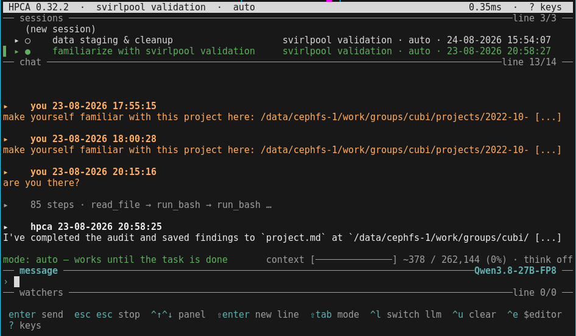

# HolisticProcessingComputeAgent (HPCA)

A terminal-based AI agent that uses local or remote LLMs to help users of an HPC
Slurm cluster with biomedical data processing. It runs on a compute node, talks to
an OpenAI-compatible LLM backend (e.g. vLLM behind an SSH tunnel), and provides a
four-row TUI: sessions, chat, and running sub-processes/jobs.



The rows, top to bottom: the header (version, session, mode, event-loop lag),
the **sessions** list, the **chat**, the mode/context line, the **message**
entry with the LLM it is talking to, the **watchers** column for jobs and logs,
and the hotkey footer.

See [project.md](project.md) for the full design document.

## Install & run

### With pixi

install pixi `curl -fsSL https://pixi.sh/install.sh | sh`

then clone HPCA `git clone git@github.com:vinzenzmay/HolisticProcessingComputeAgent.git`

then `cd HolisticProcessingComputeAgent; pixi install; pixi shell`

now cd into the project or wherever you want to start the agent and run it: `hpca`

### Without a terminal: `hpca -p`

One turn, no TUI, the reply on stdout — for scripts, CI, and other agents:

```bash
hpca -p "which of these BAMs is missing an index?"
```

It is the same agent with the same tools, working in the directory you launch it
from. What is worth knowing before you point something automated at it:

* **`--json`** gives you the session id, every tool call it made, and the token
  usage instead of the bare reply. **`--session <id>`** continues that
  conversation, with its history.
* **`--mode`** is the safety dial: `manual` stops at every command, `auto`
  (default) only at destructive ones, `full-auto` at nothing. Since nobody is
  there to answer, a stop is *approved* by default — refusing does not prevent
  the work, it only pushes the model into doing it through `run_bash`, where
  there is no backup and no diff. Use `--mode manual --refuse-gated` for a run
  that must not touch anything, and `--max-rounds N` to bound one.
* **Exit codes**: 0 answered, 1 bad arguments, 2 no LLM answering, 3 timed out,
  4 the turn failed. Progress and warnings go to stderr; stdout is the answer
  and nothing else.
* **`--home <dir>`** gives the run its own app dir. Worth doing — otherwise its
  sessions turn up in the sidebar of whoever is using the TUI.

```bash
# a scripted, bounded, read-only look at a failed job
hpca -p "why did job 4711 fail?" --json --mode manual --refuse-gated \
     --max-rounds 8 --home ~/.hpca-ci
```

### The LLM behind it

HPCA brings no model of its own — it needs an OpenAI-compatible endpoint to talk
to. [llmServer/SETUP.md](llmServer/SETUP.md) sets one up from nothing: a Slurm
job running vLLM with Qwen3.8-27B-FP8 on two L40s (262k context), plus the
embedding sidecar that document search uses.

Started servers announce themselves by dropping a JSON manifest into a shared
directory, and HPCA finds them there — on the cluster there is nothing to
configure. **That directory is named on both sides and the two must agree**:
`endpoints.endpoints_dir` in `<app dir>/settings.json` for HPCA, and
`HPCA_ENDPOINTS_DIR` (or the default inside `llmServer/write_manifest.sh`) for
the launch scripts. The shipped default is our group's path on the BIH cluster,
so on any other cluster both of them need pointing at a directory your group can
write to — change one and HPCA silently discovers nothing.

## Use HPCA like an expert
* **Provide sources**: This agent has the reasoning power but not the knowledge: always provide sources if you ask about facts.
* **No web-search**: Sources must be lokal. HPCA is forbidden to web-search.
* **Knowledge is power**: Let HPCA index any documentation or source code, so it can never invent facts. `please index this ~/my-source/`
* **small context = smart agent**: if you do large chunks of work, ask the agent to write a **plan.md** and then let it execute it step by step and use `/compact` in between each sttep to keep the agent clever. context size <= 35k is good.
* **Memory makes you fast**: form memories with `\memorize [text]` so that you don't need to tell the agent every single time where the project files are or that you use conda.

## Workings under the hood

HPCA keeps everything it stores in one directory, written `<app dir>` below.

* Config & settings: `<app dir>/settings.json`
* sessions, skills, profiles, trash bin: `<app dir>/hpca.db`

Where that directory is, is decided on the first run and never again:

* `~/work/.HolisticProcessingComputeAgent` when a `~/work` exists — the case on
  a cluster, where `$HOME` is NFS and `~/work` is not.
* `~/.HolisticProcessingComputeAgent` otherwise, which is a local machine.

An app dir that already exists wins over that rule, so `~/work` appearing under
a user who has been running out of `~` strands nothing: moving the directory is
what moves the app. To put it somewhere else entirely, set `"app_dir"` in
`settings.json` (a `~` in it is expanded) — that key is read from wherever the
rule above found the file, and everything else follows it there. `$HPCA_HOME`
overrides the lot, for a one-off run.

### TUI

The TUI is a four-row layout. Switch panels with `ctrl+↑` or `ctrl+↓`.
* header: version and info
* top: sessions
* center: chat
* center bottom: chat input
* bottom: log & process watchers
* footer: Hotkeys & controls

Typing `/` (or `\`) in the chat entry lists the available slash commands and
your skills (invoke a skill with `/<skill>`; see *Skills* below).

## Nice features

* **Watches — pin a job or a log to the right column** — most of what runs on
  a cluster was not started by hpca: an sbatch script you submitted by hand, a
  pipeline run spawning sniffles, the log that tool appends to. Ask the agent
  to watch one ("keep an eye on the sniffles log", "watch job 27744534") and it
  gets a live box in the right column: a Slurm job's state, node and remaining
  time, refreshed from `squeue` (and from `sacct` once it leaves the queue), or
  a log file's size and **how long ago it was last written to** — the quickest
  answer there is to "is it still going, or did it die?". On a box: **Enter**
  flashes the last 300 characters of the log, **`d`** stops watching (the file
  itself is never touched). Watches stay put when you switch sessions and
  survive a restart.
* **Job tracking** — a background poller watches cluster jobs (via `sacct`) and
  local subprocesses, records everything in an sqlite DB, and delivers terminal
  outcomes back into the conversation so the agent can react (a finished local
  process arrives with its exit code and a log tail; a cluster-job event announces
  the new state and points at the logs).
* **Destructive-operation safety net** — deletes, overwrites, kills, and cancels
  require explicit confirmation, and small files are hardlinked into a timestamped
  trash directory (with a TTL, cleaned on start) before being removed.
* **Profiles & memory** — per-user profiles record durable learnings and
  preferences across two scopes: `system-prompt` memories injected into the
  orchestrator's prompt (under a token budget) and `rag` memories retrieved only
  when they match the current request. Memories are proposed for your approval via
  `/memorize` and `/conclude` and stored as hand-editable markdown.
* **Grounded (RAG) answering** — the agent is steered to answer technical questions
  about external programs and APIs against indexed docs, man pages, and source
  rather than from model weights, routing them to the doc-researcher, which is
  asked to cite its sources and to mark answers it could not ground. (This policy
  is prompt-driven guidance to the model, not a hard code-enforced guarantee.)
* **Context compaction** — a long session is folded into a summary before it
  overflows the model's window (the meter above the chat shows how full it is),
  and you can fold it yourself with `/compact` — adding what the summary has to
  keep, or the step you are about to take, so it is written for what comes next.
  A summary you asked for is shown before it lands: accept it, or send it back
  with a line saying what it has to do differently (it was cut off, it lost a
  path) and the agent writes another one. Only what the model receives is
  folded; the chat itself keeps every message.
* **Skills** — user-defined procedure files the agent follows for specific tasks
  (see *Skills* below).

## Agent modes

Each session runs in one of three modes, shown on the line right above the chat
entry and cycled with `shift+tab` (`ctrl+m` also works in terminals whose
keyboard protocol can distinguish it from Enter — most cannot):

* **manual** — every script or command the agent wants to run is shown to you
  first; `y` runs it, `n` skips it (the agent is told you declined and will not
  retry it).
* **auto** — the agent works until the task is done without asking for
  confirmation. Destructive operations (delete, overwrite, kill, cancel) still
  require your approval.
* **full auto** — auto without the destructive-operation approvals: nothing
  pauses, nothing asks. The trash/backup layer still backs deletions and
  overwrites of small files, but this mode is otherwise on your own risk.

Plan mode is gone. Instead, use the inbuilt `/plan` skill. It's very good!

## Reasoning effort
You control it by typing in the chat entry: `/reasoning + ENTER`

## Skills

### run skills
The agent uses skills if it thinks that they fit, but you can also manually trigger
a skill by entering `/[SKILL]`, e.g. `/plan`.

### add skills
You can add skills with the `/skill-creator [optional description]`. If you add a description, then
the agent will prefill name, description, and body of the skill. Otherwise it's blank.

## view sills

Run `/skills-list` to see every skill the current profile can see, tagged with the
level each one resolves to (the profile's own are untagged).

### Remove a skill

Run `/skill-remove` and pick from the list.

Caveat: Global (`~/.HolisticProcessingComputeAgent/skills/_shared/`)
skills are intentionally not offered for deletion, since removing one would silently change
every other profile that sees it; delete those by removing the file directly in 

### Where skills live (levels)

A skill is stored at one of four levels, which decides who sees it. On a name
collision the most specific level wins (**project > profile > global >
built-in**):

* **built-in** — shipped with HPCA, so a fresh install already has them (see
  *Built-in skills* below). Read-only: `/skill-remove` never offers one, and
  writing your own skill with the same name simply shadows it.
* **global** — visible to every profile. Stored under
  `~/.HolisticProcessingComputeAgent/skills/_shared/`.
* **profile** — the current profile only. Stored under
  `~/.HolisticProcessingComputeAgent/skills/<profile>/`.
* **project** — tied to the directory you launch `hpca` from, and only visible
  while running there. Stored under a hidden `.hpca/skills/` in that directory, so
  a repo can carry its own procedures without them leaking into other projects.


## Serving your own LLM

HPCA is a client. It needs an OpenAI-compatible endpoint to talk to, and until
one answers there is nothing for the agent to think with — so if this is a fresh
setup, the server is the part to do first.

Everything for that is in **[llmServer/](llmServer/)**, and the guide to read is
**[llmServer/SETUP.md](llmServer/SETUP.md)**. It assumes no prior knowledge of
vLLM or Slurm and walks the whole way:

1. `./setup_venv.sh` — installs vLLM into `llmServer/venv` (~15 GB).
2. Download the weights — `Qwen/Qwen3.8-27B-FP8`, ~30 GB. Needs 16 GB of RAM,
   which is the step that most often fails silently.
3. Make an API key — `~/.vllm_api_key`, or the job refuses to start.
4. Point `--gres` and `--partition` at your cluster's GPU nodes. **The one edit
   you almost certainly need**, and the usual reason a first `sbatch` is
   rejected or pends forever.
5. `sbatch llm.a40-l40.sh`, then read the four log lines SETUP.md tells you to
   grep. Each explains a disappointing result on its own.

What you end up with: `Qwen3.8-27B-FP8` on port 20001 with a 262k context window
on two L40s at ~60 tokens/s, and an embedding sidecar on port 20000
that document search uses. The job announces itself, so HPCA on the cluster
connects with nothing configured — but see the endpoints-directory warning under
[The LLM behind it](#the-llm-behind-it) if you are not on the BIH cluster. From
a workstation, SETUP.md gives you the SSH tunnel and the `settings.json` to match.

SETUP.md is the how. The *why* — memory arithmetic per card, why two cards are
load-bearing rather than merely faster, why the KV cache must not be quantised —
lives in the comment blocks of `llmServer/llm.a40-l40.sh`, next to the values it
explains. Read those before changing a number in that script.

### A local llama.cpp or Ollama instead

Any OpenAI-compatible server works, and two of them need a line of settings that
vLLM does not, because the OpenAI shape is a floor and every server extends it
differently. In `<app dir>/settings.json`, on the backend entry:

```json
{
  "model": "qwen27_42k:latest",
  "base_url": "http://localhost:11434/v1",
  "max_model_len": 42000,
  "extra_body": { "reasoning_effort": "none" }
}
```

* **`max_model_len`** — vLLM reports the window on `/v1/models` and nothing
  needs configuring; llama.cpp-server and Ollama report nothing, and a window
  HPCA does not know is one it never compacts, so the session fills up and the
  turn fails. Startup warns once when it hits this.
* **`extra_body`** — merged into every request, last. Ollama ignores the
  `chat_template_kwargs.enable_thinking` that turns thinking off on vLLM, so
  without `reasoning_effort: "none"` the model reasons on every call: measured
  on Qwen3-27B, a file-edit turn took 81s instead of 45s, and the automatic
  session titler failed on every turn — it asks for 64 tokens of JSON and got
  64 tokens of reasoning. (Do not set this on a vLLM backend: Qwen3.8 there
  accepts only xhigh/medium/low and answers anything else with a 400.)

## Development

```bash
pixi run -e dev pytest        # or: uv run pytest
```
